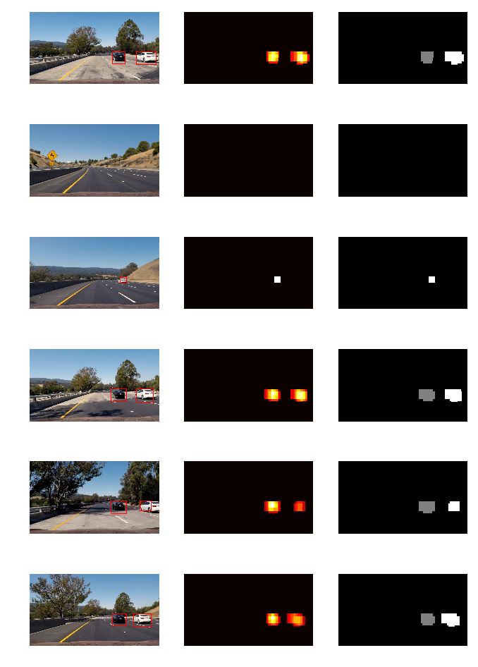

### Histogram of Oriented Gradients (HOG)

#### 1. Explain how (and identify where in your code) you extracted HOG features from the training images.
* Read training images from vehicles and non-vehicles folders.

* Extract HOG features and visualized the HOG images

#### 2. Explain how you settled on your final choice of HOG parameters.

* Color Histograms for RGB, YCrCb, HSV

Different color spaces(YCrCb,HSV,RGB) configuration

Different orientations,pix per cell, cells per block parameters configuration for YCrCb color space

* Orientations = 9, Pixel per cell = (8,8), cells per block = 2  
* Orientations = 8, Pixel per cell = (8,8), cells per block = 2
* Orientations = 9, Pixel per cell = (16,16), cells per block = 2
* Orientations = 8, Pixel per cell = (16,16), cells per block = 2
* Orientations = 9, Pixel per cell = (8,8), cells per block = 1
* Orientations = 8, Pixel per cell = (8,8), cells per block = 1

### 3. Describe how (and identify where in your code) you trained a classifier using your selected HOG features (and color features if you used them).

I trained a linear SVM using...
In **train.py** line no.77, function train() takes feature vectors as input and trains the classifier. The svc_modelfitting.ipynb, reads images(car and noncar) , calls features_extract() to get feature vectors for training the LinearSVC.Then calls train() function to model fit and model is saved as pickled file svc_pickle.p for easy access latter.

### Sliding Window Search

#### 1. Describe how (and identify where in your code) you implemented a sliding window search. How did you decide what scales to search and how much to overlap windows?

In **utils.py** line no.345, function **find_cars()** takes image as input on which vehicles are to be identified,extracts hog features for entire image at once and using hog sub-sampling to extract features for each window rather than computing hog features for each window which is time consuming. The scale factor taken as input is to alter the search window size. The higher the factor the image is reshaped down by that factor i.e indirectly increase search window size thereby number of windows search is reduced for ROI.To identify cars farther in the image, scale of 1 is used and for cars nearer, a higher scale factor of 1.5 or 2 is used. The subsampled hog features are normalized and used for prediction by classifier. If predicted 1 , the car is found in that window and drawn rectangle box and also the pixels inside the box are added with 1 creating heatmap.

#### 2. Show some examples of test images to demonstrate how your pipeline is working. What did you do to optimize the performance of your classifier?

Ultimately I searched on two scales using YCrCb 3-channel HOG features plus spatially binned color and histograms of color in the feature vector, which provided a nice result. Here are some example images:

### Video Implementation

#### 1. Provide a link to your final video output. Your pipeline should perform reasonably well on the entire project video (somewhat wobbly or unstable bounding boxes are ok as long as you are identifying the vehicles most of the time with minimal false positives.)

Here's a link to my video result

#### 2. Describe how (and identify where in your code) you implemented some kind of filter for false positives and some method for combining overlapping bounding boxes.

I recorded the positions of positive detections in each frame of the video. From the positive detections I created a heatmap and then thresholded that map to identify vehicle positions. I then used scipy.ndimage.measurements.label() to identify individual blobs in the heatmap. I then assumed each blob corresponded to a vehicle. I constructed bounding boxes to cover the area of each blob detected.

Here's an example result showing the heatmap from a series of frames of video, the result of scipy.ndimage.measurements.label() and the bounding boxes then overlaid on the last frame of video:

Here are six frames and their corresponding heatmaps:

Here is the output of scipy.ndimage.measurements.label() on the integrated heatmap from all six frames:

Here the resulting bounding boxes are drawn onto the last frame in the series:
