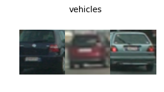
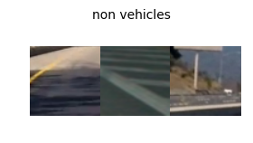
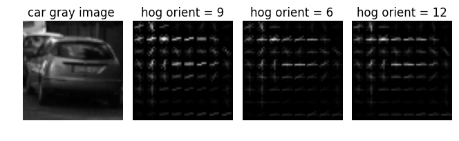
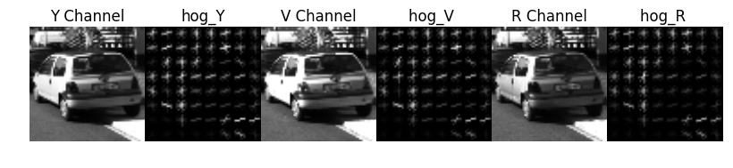
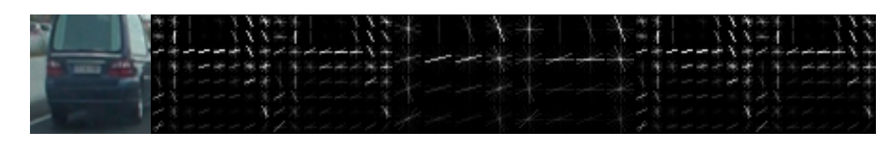
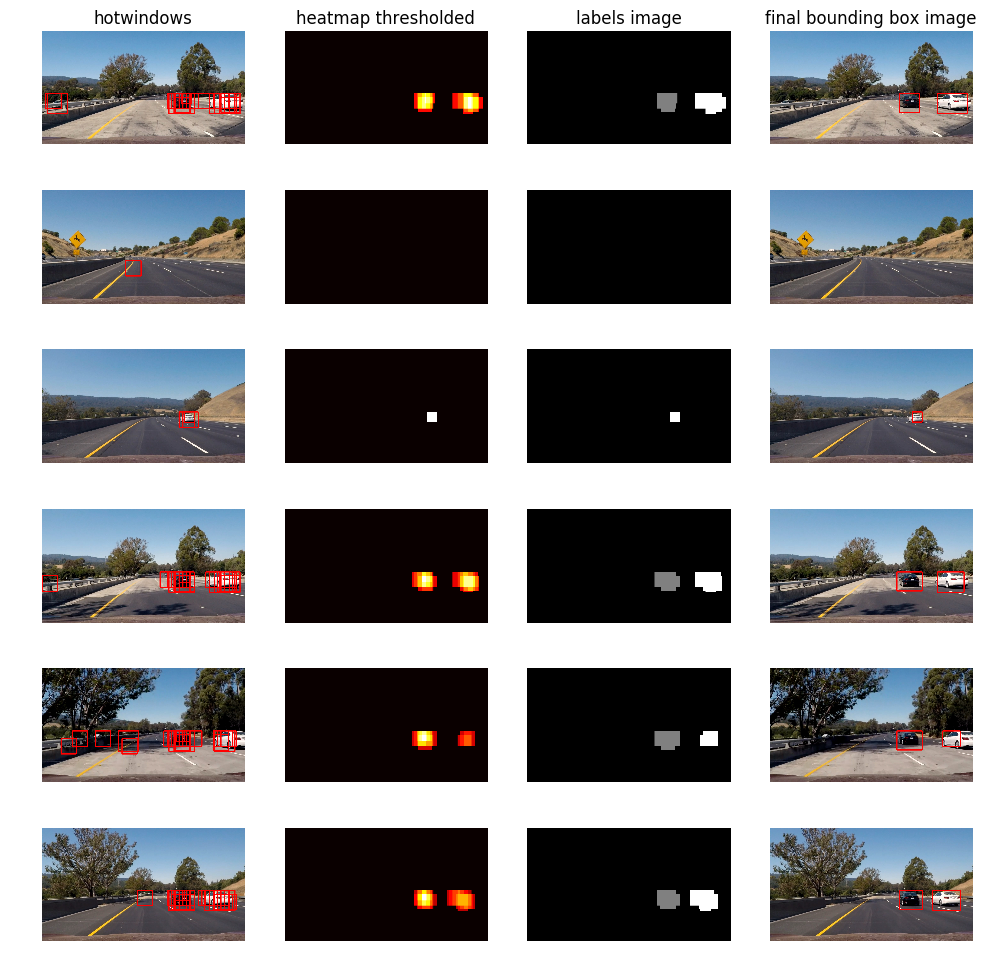

### Repository files

**P5_vehicle_tracking_solution.ipynb:** This file has main function  calling process_track() to process video files for vehicle detection and tracking.

**svc_modelfitting.ipynb:** This file is main module of training the SVC and save the model and configuration parameters as pickle file for easy access stored as **svc_pickle_allsamples.p**

**process.py:** This python  file has process_detect() used for visuals for single image analysis and process_track() function having pipeline for vehicle detection and tracking.

**train.py:** This file has training SVC functionality

**utils.py:** This file has all helper functions for this project.

**output_images folder:**  this folder has detection with final boundary box drawn for test images obtained by running the pipeline.Also few more .png files used for embedding visuals for this writeup.

### Vehicle Detection Project

The goals / steps of this project are the following:

* Perform a Histogram of Oriented Gradients (HOG) feature extraction on a labeled training set of images and train a classifier Linear SVM classifier. Apply a color transform and append binned color features, as well as histograms of color, to your HOG feature vector.
* Note: normalize features and randomize a selection for training and testing.
* Implement a sliding-window technique and use your trained classifier to search for vehicles in images.
* Run your pipeline on a video stream (start with the test_video.mp4 and later implement on full project_video.mp4) and create a heat map of recurring detections frame by frame to reject outliers and follow detected vehicles.
* Estimate a bounding box for vehicles detected.

In **P5_vehicle_tracking_solution.ipynb** file, for the above steps, explanation on implementation is provided.
Code is adapted from classroom lessons and extended with new algorithms for removing false positives,smoothening of bounding boxes around vehicles over frames.

## Rubric points

### Histogram of Oriented Gradients (HOG)

#### 1. Explain how (and identify where in your code) you extracted HOG features from the training images.
* Read training images from vehicles and non-vehicles folders.

* Extract HOG features and visualized the HOG images

In utils.py line no.18, function definition get_hog_features() obtains hog features which uses skimage.feature.hog(training_images,parameters).The hog image visualizations are obtained by configuring parameter vis as True while calling get_hog_features().

In train.py line no.18 , function features_extract() extracts hog,bin spatial and color histogram features using function extract_features() at line no.57,65 and append all to get feature vector which is used for training SVM classifier. In utils.py line no.92,is defined for function extract_features()

#### 2. Explain how you settled on your final choice of HOG parameters.

Different color spaces(YCrCb,HSV,RGB) configuration

The hog_Y is with better hog feature image compared with hog_R but par with hog_V

Different orientations,pix per cell, cells per block parameters configuration for YCrCb color space

* Orientations = 9, Pixel per cell = (8,8), cells per block = 2  
* Orientations = 8, Pixel per cell = (8,8), cells per block = 2
* Orientations = 9, Pixel per cell = (16,16), cells per block = 2
* Orientations = 8, Pixel per cell = (16,16), cells per block = 2
* Orientations = 9, Pixel per cell = (8,8), cells per block = 1
* Orientations = 8, Pixel per cell = (8,8), cells per block = 1

Choosen

Orientations = 9, Pixel per cell = (8,8), cells per block = 2 as seen from above HOG images, features for above configuration are clearly visible compared with other configurations expecially pix per cell as (16,16)

Also experimented with above configurations on classifier test accuracy of **98.75%** is highest obtained with Orientations = 9, Pixel per cell = (8,8), cells per block = 2, YCbCr,spatial bin =(16,16), Refer **train.py** file, line no.33 to 43 for complete configuration used for SVC.But observed with better accuracy like 99.05 obtained with slight different configuration above doesn't guarantee on improvement of hot windows detection accuracy.Sticking to final choice with above configuration

### 3. Describe how (and identify where in your code) you trained a classifier using your selected HOG features (and color features if you used them).

I trained a linear SVM classifier with feature vectors comprising hog, color histograms and spatial bin of training images.
In **train.py** line no.77, function train() takes feature vectors as input and trains the classifier. The svc_modelfitting.ipynb, reads images(car and noncar) , calls features_extract() to get feature vectors for training the LinearSVC.Then calls train() function to model fit and model is saved as pickled file **svc_pickle_allsamples.p** for easy access latter.

### Sliding Window Search

#### 1. Describe how (and identify where in your code) you implemented a sliding window search. How did you decide what scales to search and how much to overlap windows?

In **utils.py** line no.345, function **find_cars()** takes image as input on which vehicles are to be identified,extracts hog features for entire image at once and using hog sub-sampling to extract features for each window rather than computing hog features for each window which is time consuming. The scale factor taken as input is to alter the search window size. The higher the factor the image is reshaped down by that factor i.e indirectly increase search window size thereby number of windows search is reduced for ROI.To identify cars farther in the image, scale of 1 is used and for cars nearer, a higher scale factor of 1.5 or 2 is used. The subsampled hog features are normalized and used for prediction by classifier. If predicted 1 , the car is found in that window and drawn rectangle box and also the pixels inside the box are added with 1 creating heatmap.

The overlapping of 0.75 with each other windows is used to improve classification(line no.373 of **utils.py** file)

#### 2. Show some examples of test images to demonstrate how your pipeline is working. What did you do to optimize the performance of your classifier?

I searched on three scales(1,1.5 and 2.0 as given as input to find_cars() function equivalent of window size(64,64),(96,96) and (128,128) respectively) using YCrCb 3-channel HOG features plus spatially binned color and histograms of color in the feature vector, which helped in classification of car and notcar almost precisely . Here are test images on which my pipeline is applied:

### Video Implementation

#### 1. Provide a link to your final video output. Your pipeline should perform reasonably well on the entire project video (somewhat wobbly or unstable bounding boxes are ok as long as you are identifying the vehicles most of the time with minimal false positives.)

Here's a link to my video result

https://youtu.be/2fi5TwdafBs

Observed couple of times false positives while processing this video and rest of video frames are detected and tracked smoothly.

#### 2. Describe how (and identify where in your code) you implemented some kind of filter for false positives and some method for combining overlapping bounding boxes.

Refer process.py file

Two functions are defined. 

The function **process_detect()** is for detecting vehicles in a single image and also to return hotwindows,heatmap,labels for plotting purpose. 

The function **process_track()** is for detecting and tracking vehicles and drawing bounding boxes around vehicles for a video clip. For single image detection, process_track() functionality is same as process_detect(). This file has loading of svc model and parameters.The process_track() function takes video clip as input.It internally calls **find_cars()** function with multi-scale window sizes, detects windows where it predicts presence of car and for those windows the pixels are added heat by adding 1 to get heatmap.For all multi-scale window sizes the heatmap is calculated and summed up and saved as heatmap_sum. This summed up so that by applying threshold, the less predicted pixels (false positives) are removed given that prominent hot regions are retained.Then final boxes from heatmap is found using label() function which provides unique labels for each heatmap isolated regions as detected cars.The labeled image where pixels are set to 0 for background, 1 for car number 1, and 2 for car number 2.

The **draw_labeled_bboxes()** function takes labels image and put bounding boxes around the labeled regions.This is done by identifying x,y positions of each car region, choosing minimum x,y of non-zero pixel positions and maximum of non-zero pixel positions as boundary for bounding boxes and drawn rectangle for each car region.For first frame, bounding boxes are drawn as explained above and for subsequent frames to make smooth boundary boxes drawing, for every 3(refered as count variable) frames new boundary box is drawn, by caching.

The previous image clearly shows pictorically, 

i)The image under title '**hotwindows**' shows, the overlapping bounding boxes when searching using multi scale windows over the ROI.
One can see lot of false positives.

ii) The image under title '**heatmap thresholded**' shows, the less hotwindows are removed using threshold of 2 on the heatmap summed up of all hotwindows, i.e false positives are removed.

iii) The image under title '**labels image**' shows label image by using scipy.ndimage.measurements.label() function. The overlapped hot windows above threshold are combined by label function resulting into the isolated car regions.

iv) The image under title '**final bounding box image**' shows the clean rectangular box drawn by choosing minimum x,y of non-zero pixel positions and maximum (x,y) of non-zero pixel positions as boundary for bounding boxes and drawn rectangle for each car region.

### Discussion

#### 1. Briefly discuss any problems / issues you faced in your implementation of this project. Where will your pipeline likely fail? What could you do to make it more robust?

Here I'll talk about the approach I took, what techniques I used, what worked and why, where the pipeline might fail and how I might improve it if I were going to pursue this project further.

i) To get good testscore using SVM classifier, tuned for hog parameters,choosen color space YCrCb.Getting higher score of approx 99% was not an issue with the amount of trainining images, but using HOG+SVM resulted in number of false positives but with post processing using heatmap thresholding improved the accuracy in car detection in almost throughout the project_video.Very rarely observed window image of lane under shadow was shown as detected car.Also acheiving real time detection may need high end image processors like hardware coprocessors.

ii) To have robust detection under varoius road light coditions, more training dataset will improve in classification. The use of DNN will improve robustness in detection. The hog subsampling technique helped in fast search but still needed improvement. The search can be improved further by adaptively limiting ROI by knowing the cars detected areas of previous frames.
